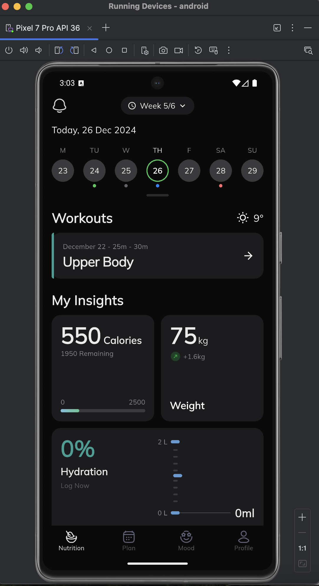
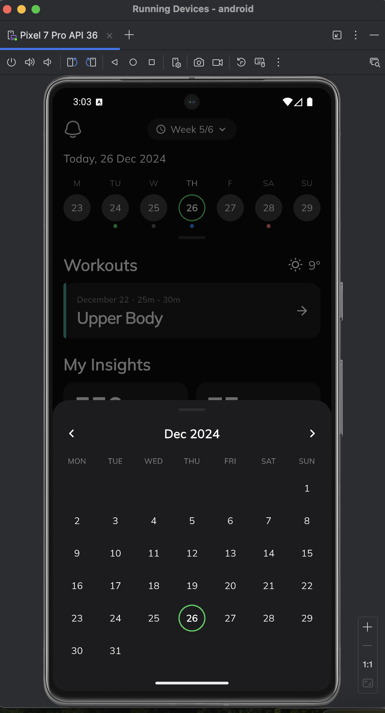
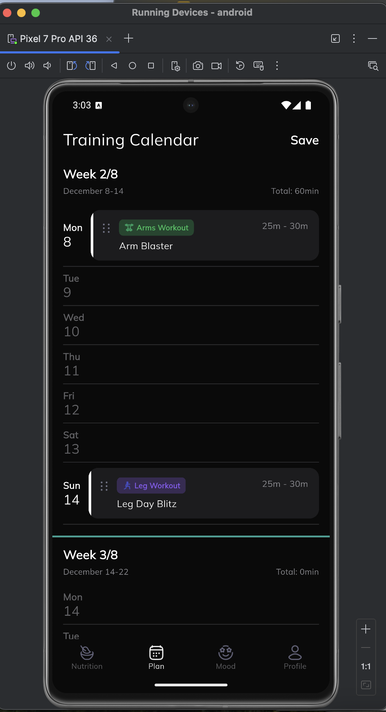
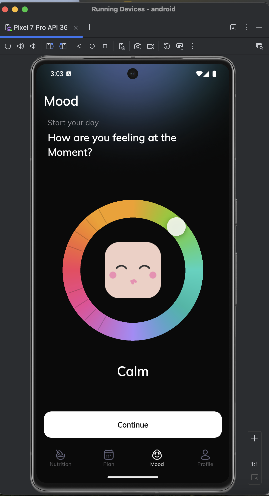

# Fitness Tracker App

A fitness tracking application built with Flutter, featuring workout tracking, calorie monitoring, weight insights, hydration logging, training calendar with drag & drop, and a mood selector wheel.

**Developer:** Taimoor Khan

---

## App APK

[Download APK](https://github.com/488taimoor/flutter_assesment/releases/download/v1.0/app-release.apk)

---

## App Screenshots

| Nutrition | Calendar | Plan | Mood |
|-----------|----------|------|------|
|  |  |  |  |

## App Video

[Watch App Demo Video](https://youtu.be/81Fk-SePPQc)

---

## Dependencies Used & Why

| Package | Why |
|---------|-----|
| `provider` | Used for state management across all screens (home, plan, mood) |
| `google_fonts` | Used for loading the Mulish font family to match the Figma design |
| `flutter_localizations` + `intl` | Used for multi-language support (English & Arabic) |
| `cupertino_icons` | Used for iOS-style icons |

---

## Project Structure

```
lib/
├── main.dart                           # App entry point
│
├── app/                                # App-level configuration
│   ├── app.dart                        # Root MaterialApp with MultiProvider, theme & localization
│   └── theme/
│       ├── app_colors.dart             # Centralized color palette
│       ├── app_text_styles.dart        # Typography styles (Mulish font)
│       └── app_theme.dart              # Dark ThemeData configuration
│
├── core/                               # Shared utilities
│   ├── constants/
│   │   └── app_spacing.dart            # Spacing, padding & radius constants
│   └── extensions/
│       └── context_extensions.dart     # BuildContext helpers (l10n, theme, size)
│
├── common/                             # Reusable UI components
│   └── widgets/
│       ├── app_card.dart               # Dark card container
│       └── section_header.dart         # Section title with optional trailing widget
│
├── features/
│   ├── home/                           # Nutrition/Home tab
│   │   ├── models/
│   │   │   ├── workout_model.dart      # Workout data model
│   │   │   └── day_info.dart           # Calendar day with activity colors
│   │   ├── provider/
│   │   │   └── home_provider.dart      # State: calendar, workouts, insights, navigation
│   │   ├── screens/
│   │   │   └── home_screen.dart        # Shell screen with IndexedStack for tab switching
│   │   └── widgets/
│   │       ├── week_selector.dart      # "Week X/Y" header with bell icon
│   │       ├── weekly_calendar.dart    # Day-of-week calendar strip with colored dots
│   │       ├── month_calendar_sheet.dart # Full month calendar bottom sheet
│   │       ├── workout_card.dart       # Workout item with teal accent border
│   │       ├── calories_card.dart      # Calorie intake with gradient progress bar
│   │       ├── weight_card.dart        # Weight display with change indicator
│   │       ├── hydration_card.dart     # Hydration tracker with water level chart
│   │       └── bottom_nav_bar.dart     # 4-tab bottom navigation with custom icons
│   │
│   ├── plan/                           # Training Calendar tab
│   │   ├── models/
│   │   │   ├── training_workout.dart   # Workout with category tag & color
│   │   │   ├── training_day.dart       # Day with optional workout
│   │   │   └── training_week.dart      # Week with days & computed total minutes
│   │   ├── provider/
│   │   │   └── plan_provider.dart      # State: weeks data, drag & drop logic
│   │   ├── screens/
│   │   │   └── plan_screen.dart        # Training calendar screen
│   │   └── widgets/
│   │       ├── plan_header.dart        # "Training Calendar" + Save button
│   │       ├── week_header.dart        # Week section header with date range
│   │       ├── day_row.dart            # Day row with DragTarget
│   │       └── workout_drag_card.dart  # LongPressDraggable workout card
│   │
│   └── mood/                           # Mood selector tab
│       ├── models/
│       │   └── mood_data.dart          # Mood with name & emoji asset path
│       ├── provider/
│       │   └── mood_provider.dart      # State: thumb angle, current mood
│       ├── screens/
│       │   └── mood_screen.dart        # Mood screen with wheel & continue button
│       └── widgets/
│           ├── mood_wheel.dart         # CustomPainter gradient ring with drag
│           └── mood_emoji.dart         # Animated emoji face display
│
└── l10n/                               # Localization
    ├── app_en.arb                      # English strings
    └── app_ar.arb                      # Arabic strings
```

### Folder Purposes

| Folder | Purpose |
|--------|---------|
| `app/` | Root widget, theming (Mulish font, dark mode), and configuration |
| `core/` | Shared constants and BuildContext extensions |
| `common/widgets/` | Reusable UI components shared across features |
| `features/home/` | Nutrition tab: calendar, workouts, calories, weight, hydration |
| `features/plan/` | Training Calendar tab: weekly schedule with drag & drop |
| `features/mood/` | Mood tab: circular mood wheel with draggable selector |
| `l10n/` | ARB localization files (English + Arabic) |

---

## Architecture & Design Notes

### Clean Architecture (Suggested for Production)

This project follows a **feature-first** structure with clear separation of concerns. For a production-scale app, the recommended Clean Architecture would extend each feature into three distinct layers:

```
features/
└── feature_name/
    ├── data/                    # Data Layer
    │   ├── data_sources/        # Remote (API) & Local (DB/Cache) data sources
    │   ├── models/              # Data Transfer Objects (DTOs) with serialization
    │   └── repositories/        # Repository implementations
    │
    ├── domain/                  # Domain Layer (Pure Dart, no Flutter imports)
    │   ├── entities/            # Business objects (no serialization logic)
    │   ├── repositories/        # Abstract repository contracts (interfaces)
    │   └── use_cases/           # Single-responsibility business logic units
    │
    └── presentation/            # Presentation Layer
        ├── providers/           # State management (Provider/ChangeNotifier)
        ├── screens/             # Full-page widgets
        └── widgets/             # Reusable feature-specific UI components
```

### Key Architecture Principles

| Principle | Description |
|-----------|-------------|
| **Dependency Rule** | Dependencies point inward: `Presentation -> Domain <- Data`. The domain layer has zero dependencies on Flutter or external packages. |
| **Repository Pattern** | Domain defines abstract contracts; Data layer provides concrete implementations. This enables easy swapping of data sources (API, mock, local DB). |
| **Use Cases** | Each business action is encapsulated in a single use case class with one public method (`call()`), keeping logic testable and reusable. |
| **Feature Isolation** | Each feature is self-contained with its own models, state, and UI. Features communicate through shared domain entities, not direct widget references. |
| **Single Source of Truth** | State flows unidirectionally: Data Source -> Repository -> Use Case -> Provider -> UI. No direct API calls from widgets. |

### Why This Structure Matters

- **Testability** — Domain logic can be unit tested without Flutter; UI can be widget tested with mock repositories.
- **Scalability** — New features are added as new folders without touching existing code.
- **Team Collaboration** — Developers can work on separate features in parallel without merge conflicts.
- **Maintainability** — Changing a data source (e.g., REST to GraphQL) only affects the data layer; domain and presentation remain untouched.

### Current Implementation Notes

In this assessment, the architecture is simplified for scope:
- **Models** serve as both entities and DTOs (no separate domain entities).
- **Providers** contain business logic directly (no separate use cases).
- **Data is mocked** inline in providers rather than coming from repository implementations.

In a production app, these would be separated into proper layers with dependency injection (e.g., `get_it` + `injectable`) and repository contracts.
